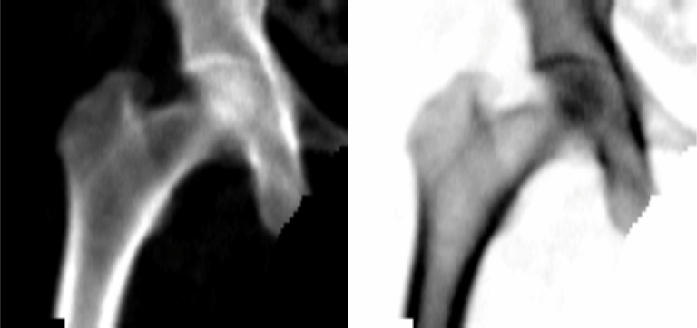
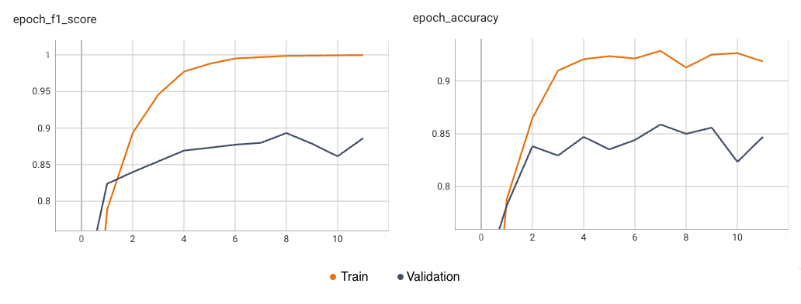

# UNIFESP X-ray Body Part Classifier Competition

Kaggle competition [link](https://www.kaggle.com/competitions/unifesp-x-ray-body-part-classifier).

## Data preprocessing

Data, X-Ray images, are provided in `*.dcm` (DICOM) format. Every file contains metadata and pixel array. Since single
file load takes plenty of time (~2s) it is handy to convert them into `*.jpg`.
Function `preprocess.convert_dcm_dataset_to_jpg` could be used for dataset conversion.

It is expected such datasets exist in directories `dataset_generated/train` & `dataset_generated/test` before training.
Images in these directories should follow `<SOPInstanceUID>.jpg` naming convention.

## Experiments

## Baseline

- Train/Validation dataset split: 1588/150
- Model: ResnetRS50 `(224, 224, 3)`
- No shuffle
- F1 Train accuracy: `0.8860`
- F1 Validation accuracy: `0.8133`
- Kaggle test score: `0.78058`

## Experiment #1: Overtrain model

- Epochs: 5 --> 10
- F1 Train accuracy: `0.953`
- F1 Validation accuracy: `0.8533`
- Kaggle test score: `0.79405`

## Experiment #2: Invert dataset images in `MONOCHROME2` format
- Dataset (train & test) regenerated - Images with `dicom.PhotometricInterpretation == MONONCHROME2` were inverted

- Epochs: 8
- F1 Train accuracy: `0.9662`
- F1 Validation accuracy: `0.8542`
- Kaggle test score: `0.80246`

## Experiment #3: Keep input image aspect ratio
- Keep aspect ratio of an input image and pad to model input resolution with black
- No improvement 

## Experiment #4: Decrease overfitting
- Simplify model architecture (just `GlobalAveragePooling` and single `Dense` layer)
- Increase validation dataset size to 20 % of training samples
- Shuffle training dataset after each iteration
- Batch size: 32 -> 64
- Epochs: 12
- Learning rate: 0.0001
- F1 Train accuracy: `0.9997`
- F1 Validation accuracy: `0.8862`
- Kaggle test score: `0.83277`
- Reached plateau on both metrics (accuracy and F1-Score) and both datasets (train and validation)

