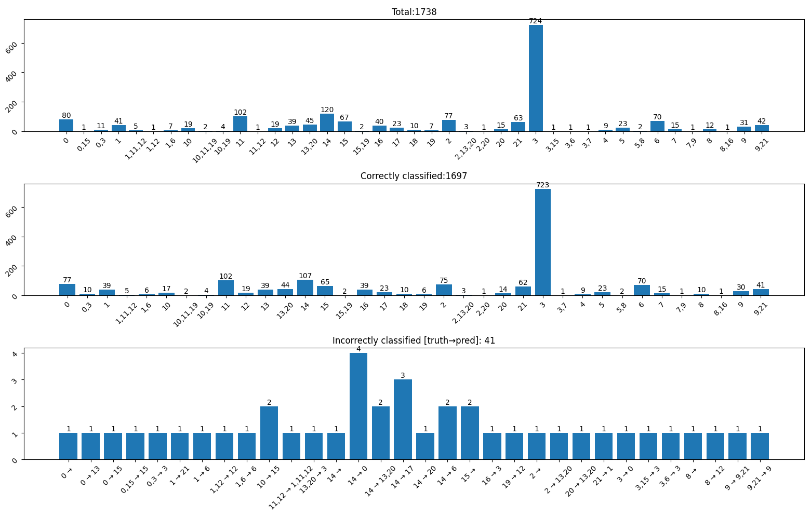
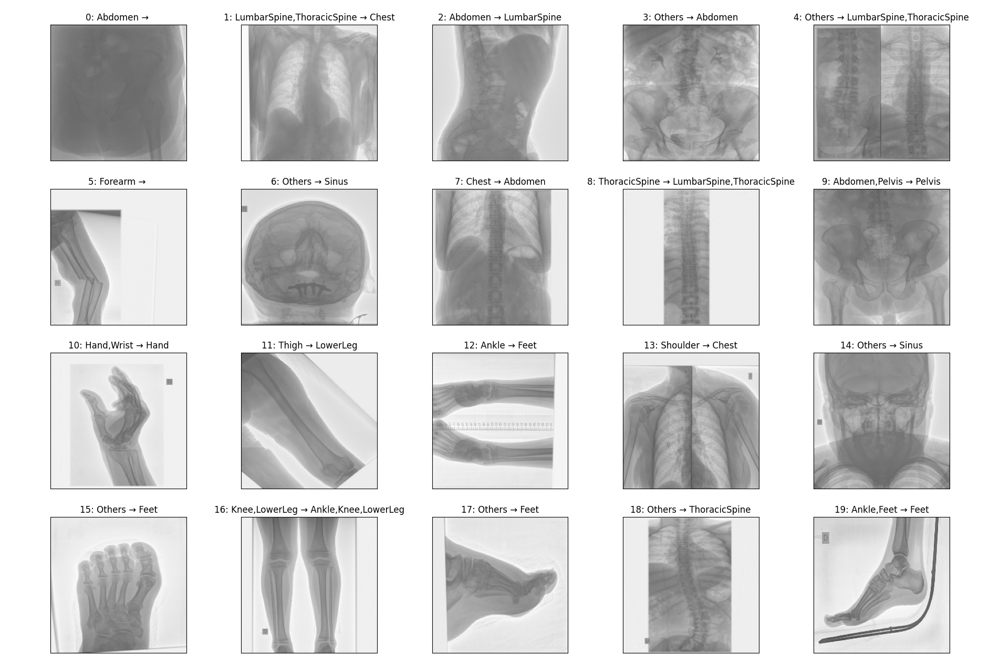
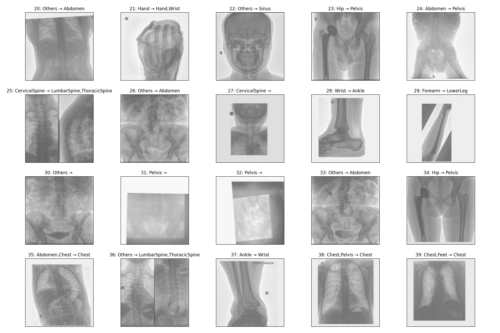

# UNIFESP X-ray Body Part Classifier Competition

Kaggle competition [link](https://www.kaggle.com/competitions/unifesp-x-ray-body-part-classifier).

## Data preprocessing

Data, X-Ray images, are provided in `*.dcm` (DICOM) format. Every file contains metadata and pixel array. Since single
file load takes plenty of time (~2s) it is handy to convert them into `*.jpg`.
Function `preprocess.convert_dcm_dataset_to_jpg` could be used for dataset conversion.

It is expected such datasets exist in directories `dataset_generated/train` & `dataset_generated/test` before training.
Images in these directories should follow `<SOPInstanceUID>.jpg` naming convention.

## Experiments

## Baseline

- Train/Validation dataset split: 1588/150
- Model: ResnetRS50 `(224, 224, 3)`
- No shuffle
- F1 Train accuracy: `0.8860`
- F1 Validation accuracy: `0.8133`
- Kaggle test score: `0.78058`

## Experiment #1: Overtrain model

- Epochs: 5 --> 10
- F1 Train accuracy: `0.953`
- F1 Validation accuracy: `0.8533`
- Kaggle test score: `0.79405`

## Experiment #2: Invert dataset images in `MONOCHROME2` format

- Dataset (train & test) regenerated - Images with `dicom.PhotometricInterpretation == MONONCHROME2` were inverted
  
- Epochs: 8
- F1 Train accuracy: `0.9662`
- F1 Validation accuracy: `0.8542`
- Kaggle test score: `0.80246`

## Experiment #3: Keep input image aspect ratio

- Keep aspect ratio of an input image and pad to model input resolution with black
- No improvement

## Experiment #4: Decrease overfitting

- Simplify model architecture (just `GlobalAveragePooling` and single `Dense` layer)
- Increase validation dataset size to 20 % of training samples
- Shuffle training dataset after each iteration
- Batch size: 32 -> 64
- Epochs: 12
- Learning rate: 0.0001
- F1 Train accuracy: `0.9997`
- F1 Validation accuracy: `0.8862`
- Kaggle test score: `0.83277`
- Reached plateau on both metrics (accuracy and F1-Score) and both datasets (train and validation)

## Experiment #5: EfficientNetV2M instead of ResnetRS50

- Use `EfficientNetV2M` with input size `(X, 320, 320, 3)`
- Batch size: 32
- Epochs: 12
- F1 Train accuracy: `0.9717`
- F1 Validation accuracy: `0.9064`
- Kaggle test score: `0.86083`

## Experiment #6: DenseNet instead of EfficientNetV2M

- Multiple epochs, multiple architectures, w/o preprocessing
- No improvement, still overfitting

## Experiment #7: Data augmentation

- Apply data augmentation to training dataset
    - CLAHE, Rotate, Brightness & Contrast, (ISO/Gauss)Noise,
- Epochs: 30 (early stopped after 25)
- F1 Train accuracy: `0.9758`
- F1 Validation accuracy: `0.9046`
- Kaggle test score: `0.92087`

### Stats

There were 41 out of 1738 images from training dataset that were not classified correctly. Mapping between `class_id`
and class name is available in [config.py](config.py). Incorrect labels are in format `[truth]→[prediction]`.

Images of 40 incorrectly classified inputs and commentary.

| Image IDs                                     | Comment / Conclusion*                                                      |
|-----------------------------------------------|----------------------------------------------------------------------------|
| `0,31,32`                                     | Image too bright / dark / low contrast. Hard to spot features.             |
| `1,2,7,8,13,15,17,18,20,22,23,28,34,35,38,39` | Questionably or erroneously labeled dataset. Model's guess not bad at all. |
| `3,4,6,14,26,33,36`                           | Truth defined as `Other`. Model made good guess.                           |
| `5,13,23,34`                                  | Highly atypical data (broken bones etc.). Model could perform better.      |
| `10,19,35,40`                                 | Model found only part of the labels.                                       |
| `16,21`                                       | Model classified most of the labels correctly, but added incorrect ones.   |
| `11,12,24,25,27,29,30,37`                     | Just wrong classification.                                                 |
| `13,25,36`                                    | Image combined from more than 1 x-ray scan.                                |

*Some conclusion might not be completely correct since I'm not expert in radiology.

## Experiment #8: Less epochs

- 25 epochs was probably too much and model was overtrained
- Epochs: 25 -> 20
- Input size: `(224, 224, 3)`
- F1 Train accuracy: `0.9658`
- F1 Validation accuracy: `0.9044`
- Kaggle test score: `0.93827`